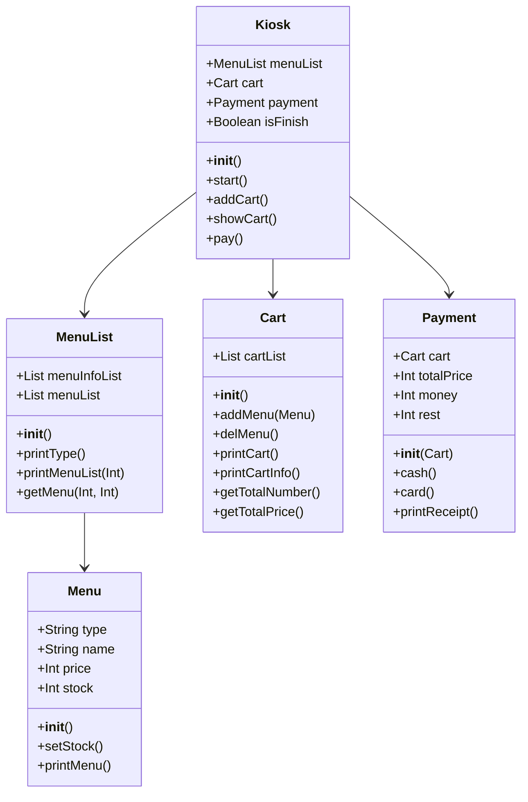

# 프로그램 명세

개발 언어 : Python 3  
과정 : [기초 과정] 파이썬 응용 프로그램 과정  
주차 : 3주차  
과제 : 카페의 Kiosk 소프트웨어 개발  
조건 : 개발 전, 기능을 구상하고 Class Diragram을 설계하여 이를 기반으로 개발  

# 함수 명세

1. 생성자 : 해당 class의 생성자 함수
2. 양식 함수 : 입력을 받아 특정 로직을 처리하는 함수
3. 출력 함수 : 출력만을 하는 함수
4. 반환 함수 : 데이터를 반환하는 함수

# Class Diagram

